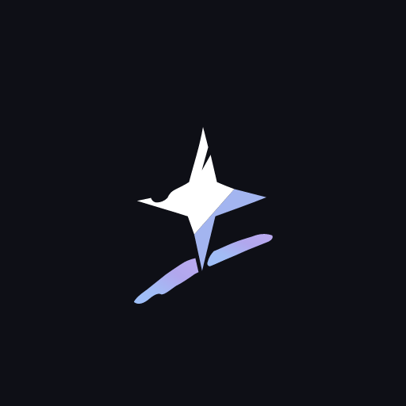

<div align="center">



# ReveriePaint

[简体中文](README.md) | [English](README_EN.md)

<p>
  <a href="https://reveriepaint.lanrhyme.top"></a>
  <a href="https://reveriepaint.lanrhyme.top/docs/"></a>
  <a href="https://github.com/LanRhyme/ReveriePaint/releases"></a>
  <a href="https://mirrorchyan.com/zh/projects?rid=ReveriePaint&os=android"></a>
  
  
  <a href="LICENSE"></a>
  <a href="https://afdian.com/a/LanRhyme"></a>
  
</p>

基于 Krita 图像内核与 Jetpack Compose 构建的 Android 原生绘画应用

</div>

---

## 官方导航

- **项目官网**: [reveriepaint.lanrhyme.top](https://reveriepaint.lanrhyme.top)
- **使用文档**: [reveriepaint.lanrhyme.top/docs/](https://reveriepaint.lanrhyme.top/docs/)

---

## 项目架构

ReveriePaint 采用混合架构设计:

```
Kotlin / Jetpack Compose UI (现代化触控交互与界面)
       │ JNI
C++ ReverieCore (文档状态与渲染管线)
       │ C++
Krita Core Engine (KisImage / KisPainter / KisPaintOp)
```

- **界面层**: Jetpack Compose 构建, 针对平板触控与手势深度定制, 支持 Material You 动态色彩与自定义主题
- **核心层**: C++ 原生引擎, 封装 Krita 笔刷与图像合成流水线, 文档操作与投影合成均在渲染后台异步执行

---

## 核心能力

- **Krita 原生笔刷系统**: 复用 Krita 核心画笔管线, 内置 240+ 预设, 支持笔刷工坊实时微调动态与压感响应曲线
- **图层与混合体系**: 支持图层组嵌套、滤镜图层、剪贴蒙版、Alpha 锁定与 25 种图层混合模式
- **手写笔与手势交互**: 低延迟压感适配、悬浮光标预览、双指捏合缩放旋转及双指点击撤销手势
- **事件流回放与安全保存**: 二进制轻量笔迹录制, 支持倍速延时回放与后台定时自动保存机制

更多功能细节与开发文档可参阅 [官方使用指南](https://reveriepaint.lanrhyme.top/docs/)、[AGENTS.md](AGENTS.md) 与 [CONTRIBUTING.md](CONTRIBUTING.md)

---

## 下载与使用

### 运行环境
- 操作系统: Android 7.0 及以上 (API 23+)
- 架构支持: 仅支持 64 位 ARM (`arm64-v8a`)
- 推荐配置: 支持主动式压感手写笔的 Android 平板设备

### 安装渠道
- **官方 Release**: 前往 [GitHub Releases](https://github.com/LanRhyme/ReveriePaint/releases) 下载最新 APK 安装包
- **国内镜像**: 通过 [Mirror酱](https://mirrorchyan.com/zh/projects?rid=ReveriePaint&os=android) 获取高速下载

---

## 贡献者

感谢所有为 ReveriePaint 提交代码、修复问题与改进设计的贡献者:

<a href="https://github.com/LanRhyme/ReveriePaint/graphs/contributors">
  
</a>

欢迎查阅 [CONTRIBUTING.md](CONTRIBUTING.md) 了解如何参与项目开发与代码规范

---

## 赞助与支持

本项目由独立开发者与社区爱好者维护, 如果 ReveriePaint 对你的创作有所帮助, 欢迎通过爱发电支持我们持续迭代:

- **爱发电**: [afdian.com/a/LanRhyme](https://afdian.com/a/LanRhyme)

---

## 开源许可与致谢

- **应用源码**: [GPL-3.0 License](LICENSE)
- **图像内核**: [Krita](https://invent.kde.org/graphics/krita) (GPL-3.0)
- **图标资源**: [Tabler Icons](https://tabler.io/icons) (MIT)

---

## 交流与反馈

- **官方网站**: [reveriepaint.lanrhyme.top](https://reveriepaint.lanrhyme.top)
- **使用文档**: [reveriepaint.lanrhyme.top/docs/](https://reveriepaint.lanrhyme.top/docs/)
- **QQ 交流群**: 729283213
- **问题反馈与建议**: 提交至 [GitHub Issues](https://github.com/LanRhyme/ReveriePaint/issues)
